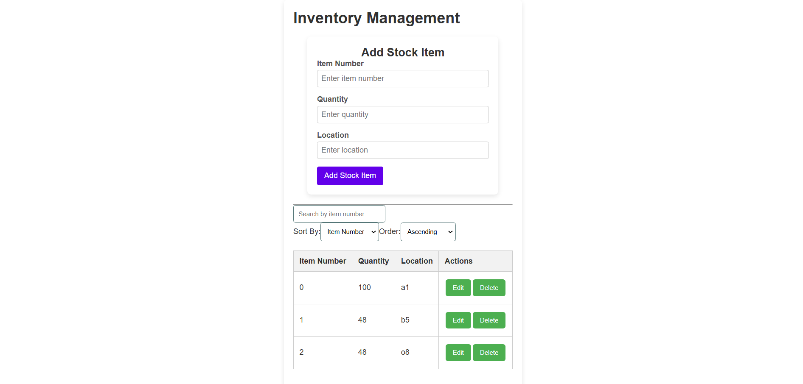

# PeakSystems Interview Assignment



## Table of Contents

- [Features](#features)
- [Technologies Used](#technologies-used)
- [Setup Instructions](#setup-instructions)
- [Usage](#usage)
- [API Endpoints](#api-endpoints)

## Features

- Add new stock items
- Update existing stock items
- Delete stock items
- View a list of stock items with search and sorting functionality
- Real-time updates to the stock inventory

## Technologies Used

- **Frontend**: Angular: 18.2.9 (newest during development), TypeScript, HTML, CSS
- **Backend**: REST ASP.NET API
- **Database**: SQL Server
- **Other Libraries**: RxJS

## Setup Instructions

To run this project locally, follow these steps:

1. **Clone the Repository**:
   - ```bash
     git clone https://github.com/lukaskristensen/peaksystems-project.git
     ```
   - ```bash
     cd inventory-management
     ```

2. **Install Dependencies**
   Make sure you have [Node.js](https://nodejs.org/) installed, then run:
   - ```bash
     npm install
     ```

3. **Set Up the Backend**

   - Navigate to the backend project (`InventoryAPI`).
   - Run the backend server (exposes a port at `http://localhost:5258/`):
     - ```bash
       dotnet run
       ```

4. **Run the Frontend**
   - Navigate to the backend project (`inventory-management`).
   - Run the frontend application (starts the application at `http://localhost:4200/`):
     - ```bash
        ng serve
       ```

## Usage

- Navigate to `http://localhost:4200/` in your web browser.
- You will see the Inventory Management interface.
- You can add, update, or delete stock items as needed.
- Use the search functionality to filter items.

## API Endpoints

### Stock Items API

| Method | Endpoint             | Description                   |
| ------ | -------------------- | ----------------------------- |
| GET    | /api/StockItems      | Retrieve all stock items      |
| GET    | /api/StockItems/{id} | Retrieve a stock item by ID   |
| POST   | /api/StockItems      | Create a new stock item       |
| PUT    | /api/StockItems/{id} | Update an existing stock item |
| DELETE | /api/StockItems/{id} | Delete a stock item           |
